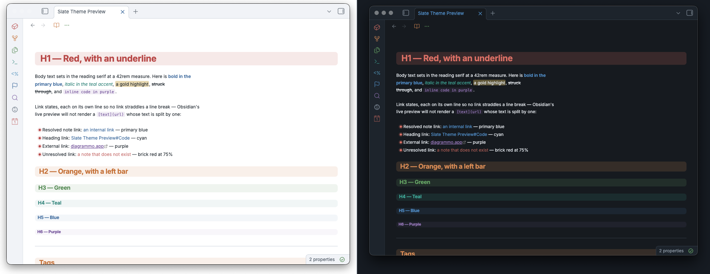

# Diagrammo Slate

An Obsidian theme built on the **Slate** palette from
[diagrammo.app/palette](https://diagrammo.app/palette/) — a cool-gray ground, a
confident corporate blue, a muted teal accent, and a nine-hue categorical
spectrum tuned to a single perceived weight.

Slate was designed so no series shouts. This theme takes that even-weight
spectrum and spends all of it: headings, callouts, tags, folders, syntax, task
states, graph nodes and canvas all carry hue, and none of it fights.

Light and dark are both first-class — the palette ships distinct values for
each, not one set with opacity tricks.



## Palette

| Role | Light | Dark |
| --- | --- | --- |
| Background | `#ffffff` | `#161b22` |
| Surface | `#f3f5f8` | `#202833` |
| Overlay | `#eaeef3` | `#29323e` |
| Border | `#d4dae1` | `#38424f` |
| Text | `#1f2933` | `#e6eaef` |
| Muted | `#5b6672` | `#9aa5b1` |
| Primary | `#3b6ea5` | `#5b9bd5` |
| Accent | `#3a9188` | `#45b3a3` |

| Spectrum | Light | Dark |
| --- | --- | --- |
| Red | `#c0504d` | `#e07b6e` |
| Orange | `#cc7a33` | `#e0975a` |
| Yellow | `#c9a227` | `#d9bd5a` |
| Green | `#5b9357` | `#74b56e` |
| Blue | `#3b6ea5` | `#5b9bd5` |
| Purple | `#7d5ba6` | `#a585c9` |
| Teal | `#3a9188` | `#45b3a3` |
| Cyan | `#4f96c4` | `#62b0d9` |
| Gray | `#7e8a97` | `#95a1ae` |

**Every color in this theme is one of the thirty values above, verbatim.**
Nothing is darkened, lightened or shifted to make a role work. Where a color
doesn't work for a job, a different palette color takes the job.

The one consequence: yellow never carries ink on the light ground. `#c9a227`
lands at 2.4:1 on white, under the 3:1 floor even for large text, so it is
absent from headings, tags, folder depths, callout titles and task markers.
It keeps every job where it is a fill rather than a foreground — highlight
background, canvas color 3, the `--color-yellow` slot plugins read.

Opacity is used for washes, borders and hover states. That is compositing a
palette color against a palette background, not a new value.

## What is colored

- **Headings** — H1–H6 walk red → orange → green → teal → blue → purple, warm
  to cool. Each sits on a rounded block washed in its own hue, stepping down in
  strength as the level descends: H1 at 12% through H6 at 5%. No underlines —
  the block, the hue and the size already encode level three times over, and a
  rule on top of a rounded block fights the radius. The outline pane mirrors
  the ladder.
- **Callouts** — every built-in type maps to a spectrum hue:
  note/info/todo blue, tip teal, success green, question cyan, warning orange,
  failure/danger red, example purple, summary/quote gray.
- **Tags** — hued by first character across eight buckets, stepping through the
  spectrum and wrapping every eighth letter (`a`/`i`/`q`/`y` → red, `b`/`j`/`r`
  /`z` → orange, and so on; digits → gray). CSS can't hash a string, so this is
  the closest deterministic approximation. Live preview has no tag name in the
  DOM, so tags there take the teal accent pill.
- **Folders** — file-explorer folders tint by nesting depth on the same
  red → orange → green → teal → blue → purple ladder, six levels deep,
  with a matching left rule on the children container. Files inherit their
  folder's hue at reduced strength, so each subtree reads as one block of
  color while the folder still leads on weight. Files at the vault root fall
  back to the muted ink.
- **Syntax** — keywords red, strings green, functions purple, properties cyan,
  values teal, operators orange. Inline code is purple ink on a purple wash;
  fenced blocks sit on the neutral panel with a purple spine.
- **Tasks** — `[>]` blue, `[!]` orange, `[?]` cyan, `[*]` purple, `[-]` red and
  struck through. Only a real `[x]` dims.
- **Mermaid** — flowchart nodes primary, sequence actors accent, class and
  state diagrams purple, ER teal, notes gold, edges gray. Mindmap and gantt
  sections walk the rotation. Mermaid scopes its injected styles by diagram id,
  so this is the one section of the theme that requires `!important`. Label
  color is set across the whole subtree rather than per diagram type: mermaid
  renders some labels as SVG `<text>` and others as HTML in a `<foreignObject>`,
  and which is used moves between versions.
- **Graph & canvas** — nodes blue, focused orange, tags teal, attachments
  purple, unresolved red. Canvas colors 1–6 map to the spectrum.
- **Nesting** — list bullets, nested blockquotes and live-preview indentation
  guides all walk the same six-step ladder the file explorer and the headings
  use, so depth reads identically whichever structure you are looking at.
  Both reading view and live preview get the full ladder — live preview list
  lines and quote lines carry their depth as a class, and indentation guides
  are colored per level on top of that. Bullets run at `0.5em` with a halo of
  their own hue at 18%, since the stock `0.3em` dot is too small to carry a
  color.
- **Links by target** — note links blue, heading links cyan, block references
  purple, attachments and canvases teal, external purple, unresolved red.
- **Inline detail** — inline title blue, math teal, footnote refs
  and backrefs teal, block IDs purple, markdown comments gray italic, active
  line number blue, fold arrows orange, matching brackets teal.
- **Workspace** — tab and sidebar icons take a hue per view type: markdown
  blue, canvas purple, PDF red, media green, graph teal, bases and explorer
  orange, search cyan, bookmarks red, outline green, backlinks purple. Result
  counts render as tinted pills.
- **Chrome** — the ribbon rail and pane action icons take a hue by position,
  rotating through the spectrum and wrapping every eighth, so a rail of any
  length stays evenly spread. There is no attribute saying what a ribbon button
  does — the label is plugin-supplied and localized — so position is the only
  stable key. Every other `.clickable-icon` shares one state ladder: muted
  idle, primary on hover, accent when active. Tab close goes red on hover, the pane drop target primary, context
  menu items primary on hover and red when destructive. Tooltips and toasts sit
  on the overlay surface, the settings nav and plugin browser take the primary,
  and empty panes get a primary call to action.

The ladder used for headings, folder depth, list depth and quote depth is one
sequence: **red → orange → green → teal → blue → purple**. Yellow, cyan and
gray sit outside it and carry other jobs.

## Opinions

The theme takes a few positions beyond color, each reversible from Style
Settings:

- **The note's name appears once**, on its tab. Obsidian states it three times
  by default — tab, view header, inline title — before a word of content
  appears. The view header keeps its nav buttons and actions; only the title
  and its breadcrumb chain go.
- **No small caps**, anywhere.
- **No heading underlines.** Level is already carried by hue, wash strength and
  type size.

## Print, motion and color vision

Print and PDF export drop every wash — a 12% tint reads as color on screen but
prints as a gray band — while keeping hue on the ink itself, which is what
carries the structure. `prefers-reduced-motion` is honored.

The default ladder puts red at level 1 and green at level 3, the hardest pair
to separate under deuteranopia and protanopia. Level is also encoded by wash
strength and type size, so the ladder is rarely the only signal — but where it
is (folder depth, bullets), the **Colorblind-safe ladder** toggle reorders it
to lead with blue and orange.

## Typography

System fonts only — nothing is downloaded.

- Interface: Inter → system sans
- Body: Iowan Old Style → Charter → Palatino → Georgia
- Code: JetBrains Mono → SF Mono → IBM Plex Mono → Menlo

Measure is `42rem`, body line height `1.7`, headings tracked at `-0.018em`.

> If you have set **Font** under Appearance in Obsidian, your setting wins over
> the theme's. Clear the Text font field to get the serif reading face.

## Install

### With BRAT

Add `demian0311/obsidian-slate` as a beta theme in
[BRAT](https://github.com/TfTHacker/obsidian42-brat).

### From the community list

Not submitted yet — see [RELEASING.md](RELEASING.md).

### Manually

Copy `theme.css` and `manifest.json` into
`<vault>/.obsidian/themes/Diagrammo Slate/`, then pick the theme under
Settings → Appearance.

## Customizing

The theme ships a [Style Settings](https://github.com/mgmeyers/obsidian-style-settings)
block. Everything colorful is **on by default** and the toggles turn things
*off*, so the theme looks the same with or without the plugin installed:

- Colorblind-safe ladder — reorder depth to lead with blue and orange
- Show note title in the view header — restore the name next to the nav buttons
- Show inline title — restore the large note name atop the note body
- Show folder breadcrumbs — restore the folder path (needs the header title)
- Plain headings — drop the H1–H6 spectrum ladder
- No heading tint — drop the block wash behind headings
- Plain folders — neutral file explorer
- Plain tags — all tags take the teal accent
- Plain horizontal rules — hairline instead of the spectrum gradient
- Plain bold & italic — uncolored emphasis
- Sans-serif body — interface sans for note text
- Line width — the readable measure, default `42rem`

## Development

`theme.css` is hand-written, no build step.

For live editing, the working copy has to live where Obsidian's file watcher
can see it. Obsidian does not follow a symlink out of `.obsidian/themes/`, so
symlinking the repo *into* a vault gives you a theme that loads once and never
hot-reloads. Put the real files in the vault and symlink back out instead:

```sh
git clone <repo> "<vault>/.obsidian/themes/Diagrammo Slate"
ln -s "<vault>/.obsidian/themes/Diagrammo Slate" ~/code/obsidian-slate
```

Now saving `theme.css` reloads the theme immediately. `Cmd+R` forces a reload
if the watcher misses a change.

## Credits

Palette: the `slate` palette from [Diagrammo](https://diagrammo.app).

## License

MIT
