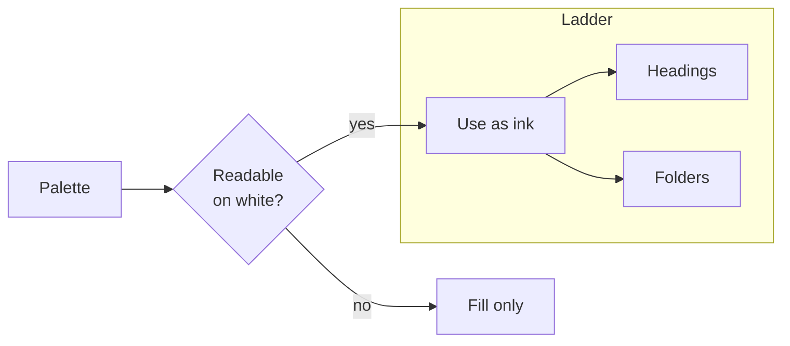
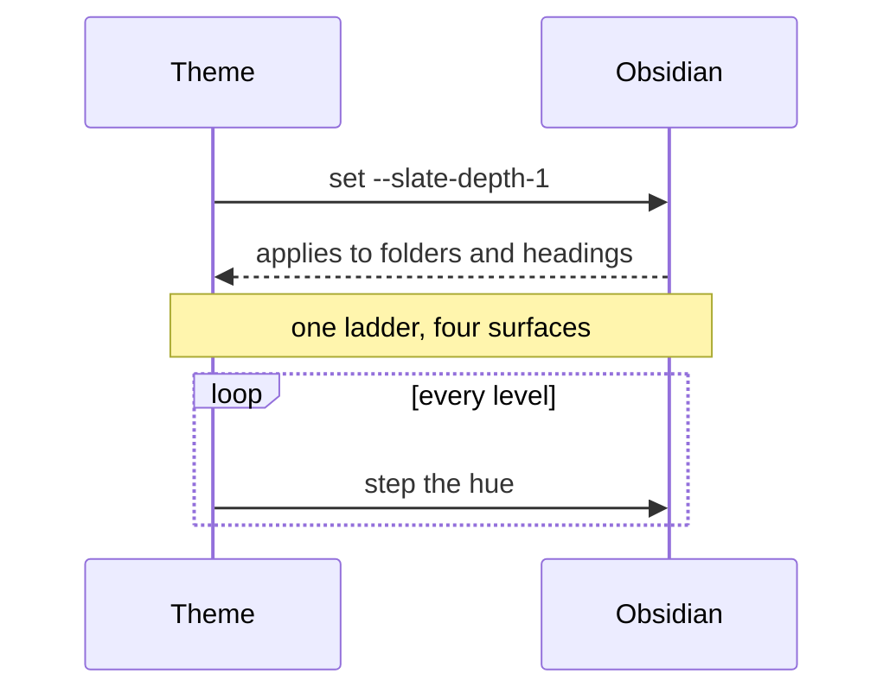
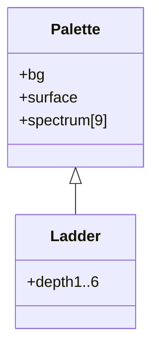
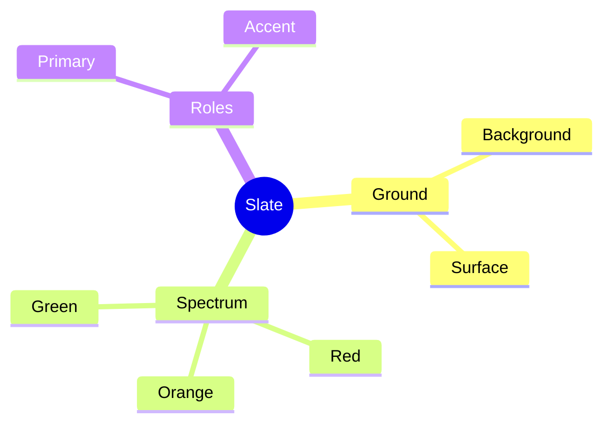

---
tags:
  - design
  - theme
status: draft
---

# H1 — Red

Body text sets in the reading serif at a 42rem measure. Here is **bold in the
primary blue**, *italic in the teal accent*, ==a gold highlight==, ~~struck
through~~, and `inline code in purple`.

Link states, each on its own line so no link straddles a line break — Obsidian's
live preview will not render a `[text](url)` whose text is split by one:

- Resolved note link: [[Slate Theme Preview|an internal link]] — primary blue
- Heading link: [[Slate Theme Preview#Code]] — cyan
- External link: [diagrammo.app](https://diagrammo.app) — purple
- Unresolved link: [[a note that does not exist]] — brick red at 75%

## H2 — Orange

### H3 — Green

#### H4 — Teal

##### H5 — Blue

###### H6 — Purple

---

## Tags

#alpha #beta #charlie #delta #echo #foxtrot #golf #hotel #india #project #work
#2026

## Callouts

> [!note] Note — blue
> Contents.

> [!tip] Tip — teal
> Contents.

> [!success] Success — green
> Contents.

> [!question] Question — cyan
> Contents.

> [!warning] Warning — orange
> Contents.

> [!danger] Danger — red
> Contents.

> [!example] Example — purple
> Contents.

> [!quote] Quote — gray
> Contents.

## Tasks

- [ ] Open
- [x] Done
- [>] Forwarded — blue
- [!] Important — orange
- [?] Question — cyan
- [*] Starred — purple
- [-] Cancelled — red

## Code

```ts
export const slatePalette: PaletteConfig = {
  id: 'slate',
  name: 'Slate',
  light: {
    bg: '#ffffff', // clean slide white
    primary: '#3b6ea5',
    colors: { red: '#c0504d', green: '#5b9357' },
  },
};
```

## Table

| Hue | Light | Dark |
| --- | --- | --- |
| Red | `#c0504d` | `#e07b6e` |
| Green | `#5b9357` | `#74b56e` |
| Blue | `#3b6ea5` | `#5b9bd5` |

## Quote

> A restrained, presentation-grade palette — the "not very stylistic" option
> done tastefully.

## Nesting ladder

- Depth 1 — red
    - Depth 2 — orange
        - Depth 3 — green
            - Depth 4 — teal
                - Depth 5 — cyan
                    - Depth 6 — purple

> Depth 1 quote — red
>
> > Depth 2 quote — orange
> >
> > > Depth 3 quote — green

## Inline detail

Math inline $E = mc^2$ and a block:

$$\int_0^\infty e^{-x}\,dx = 1$$

A footnote reference[^1] and a block reference [[Slate Theme Preview#Tasks]].

%% a markdown comment, gray and italic %%

[^1]: The footnote definition, in the teal accent.

An attachment link, teal if the file exists: [[diagram.canvas]]

## Mermaid

Flowchart — nodes primary, edges gray, subgraph on the gray wash.



Sequence — actors accent, notes gold, loop lines purple.



Class — purple fills and dividers.



Mindmap — sections walk the rotation.


